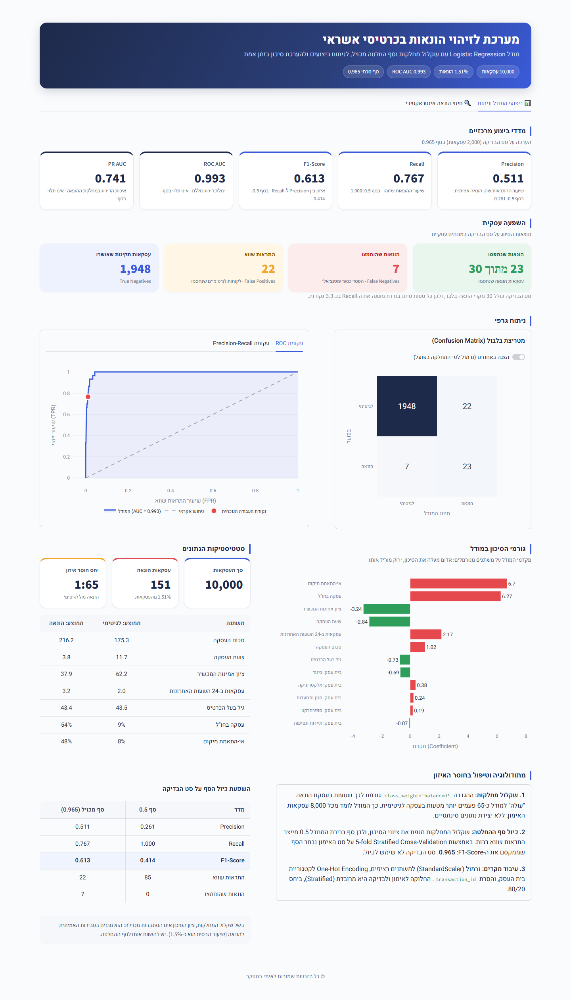
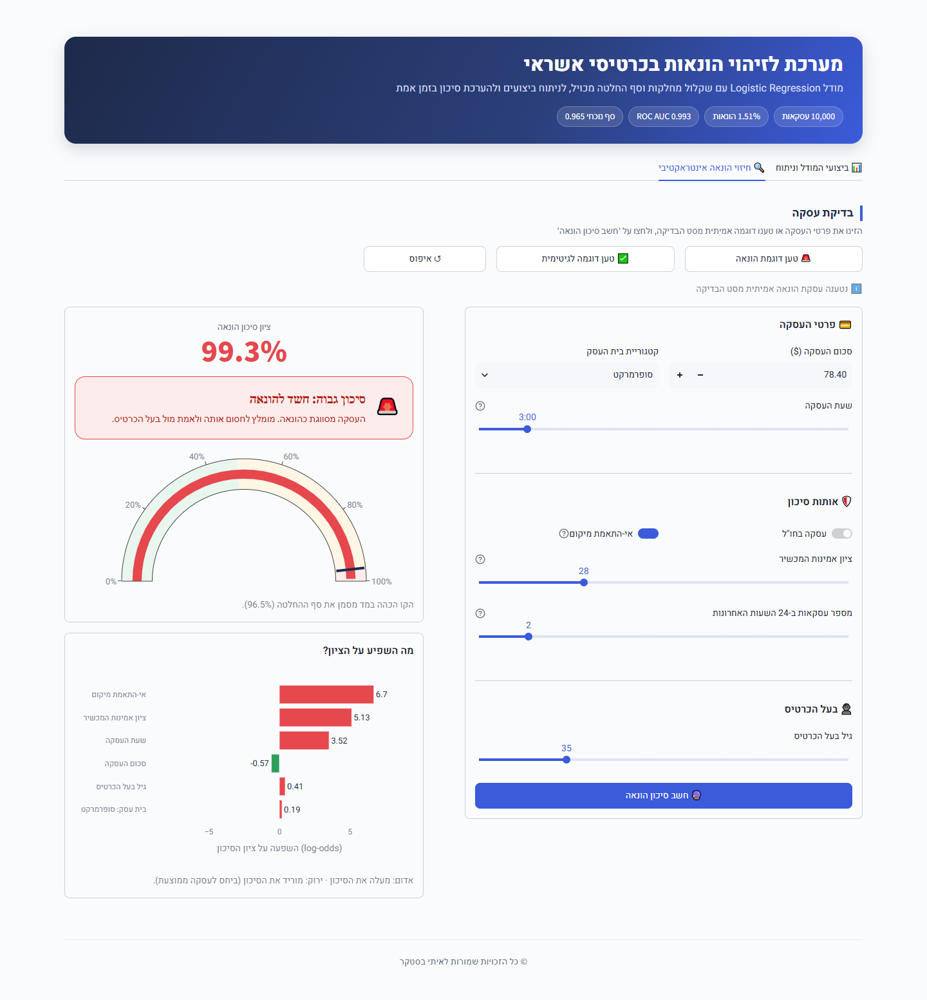

<div align="center">

# זיהוי הונאות בכרטיסי אשראי
### מודל Machine Learning ודשבורד אינטראקטיבי לניתוח סיכונים

[](https://www.python.org/)
[](https://streamlit.io/)
[](https://scikit-learn.org/)
[](LICENSE)

<br>

[](https://credit-card-fraud-detection-by-itaybasteker.streamlit.app/)

**[לצפייה בדשבורד החי ←](https://credit-card-fraud-detection-by-itaybasteker.streamlit.app/)**

</div>

פרויקט Machine Learning מקצה לקצה לזיהוי עסקאות הונאה בכרטיסי אשראי. הפרויקט משלב מודל **Logistic Regression** עם שקלול מחלקות, **סף החלטה (Decision Threshold)** שכויל באמצעות Cross-Validation, ודשבורד **Streamlit** אינטראקטיבי לניתוח ביצועי המודל ולחיזוי סיכון בזמן אמת.

---

## תקציר מנהלים

| מדד | ערך | משמעות |
|---|:---:|---|
| **ROC AUC** | **0.993** | הפרדה כמעט מושלמת בין עסקאות הונאה לעסקאות לגיטימיות |
| **F1-Score** | **0.613** | שיפור של 48% לעומת סף ברירת המחדל (0.414) |
| **Precision** | **0.511** | פי 2 לעומת סף ברירת המחדל (0.261) |
| **Recall** | **0.767** | זיהוי של 23 מתוך 30 מקרי הונאה בסט הבדיקה |
| **התראות שווא** | **22 במקום 85** | ירידה של 74% בחסימת לקוחות לגיטימיים |

---

## תוכן עניינים

1. [הבעיה העסקית](#הבעיה-העסקית)
2. [מאגר הנתונים](#מאגר-הנתונים)
3. [מתודולוגיה ו-Pipeline](#מתודולוגיה-ו-pipeline)
4. [ביצועי המודל ותוצאות](#ביצועי-המודל-ותוצאות)
5. [יכולות הדשבורד](#יכולות-הדשבורד)
6. [מבנה הפרויקט](#מבנה-הפרויקט)
7. [התקנה והרצה מקומית](#התקנה-והרצה-מקומית)
8. [פריסה ב-Streamlit Community Cloud](#פריסה-ב-streamlit-community-cloud)
9. [מגבלות וכיווני פיתוח](#מגבלות-וכיווני-פיתוח)
10. [רישיון](#רישיון)

---

## הבעיה העסקית

זיהוי הונאות הוא בעיית סיווג קלאסית עם **חוסר איזון קיצוני בין המחלקות**. מתוך 10,000 העסקאות במאגר, רק **151 (1.51%)** הן עסקאות הונאה, כלומר יחס של כ-**1:65**.

מודל שמסווג כל עסקה כלגיטימית ישיג **דיוק (Accuracy) של 98.5%**, אך **לא יזהה אף מקרה הונאה**. לכן Accuracy אינו מדד רלוונטי, והפרויקט מתמקד ב-Precision, ב-Recall, ב-F1-Score ובמדדי AUC.

כל מערכת לזיהוי הונאות נדרשת לאזן בין שני סוגי שגיאות:

| סוג השגיאה | משמעות | המחיר העסקי |
|---|---|---|
| **False Negative** | עסקת הונאה שאושרה | הפסד כספי ישיר, Chargebacks וחשיפה רגולטורית |
| **False Positive** | עסקה לגיטימית שנחסמה | פגיעה בחוויית הלקוח, נטישת רכישות, עומס על מוקד השירות ונטישת לקוחות |

הפרויקט מבצע אופטימיזציה מפורשת של האיזון הזה, ומאפשר לחקור אותו באופן אינטראקטיבי באמצעות סף החלטה מתכוונן.

---

## מאגר הנתונים

הקובץ `credit_card_fraud_10k.csv` כולל 10,000 עסקאות ו-8 משתנים מסבירים, ללא ערכים חסרים וללא כפילויות.

| משתנה (Feature) | סוג | ממוצע: הונאה מול לגיטימי |
|---|---|---|
| `amount` | רציף | 216 מול 175 |
| `transaction_hour` | רציף (0–23) | **3.8 מול 11.7** (הונאות מתרכזות בשעות הלילה) |
| `merchant_category` | קטגוריאלי (5 ערכים) | אות חלש |
| `foreign_transaction` | בינארי | **54% מול 9%** |
| `location_mismatch` | בינארי | **48% מול 8%** |
| `device_trust_score` | רציף (0–99) | **38 מול 62** |
| `velocity_last_24h` | רציף | 3.2 מול 2.0 |
| `cardholder_age` | רציף | ללא אות |
| `is_fraud` | **משתנה המטרה** | 151 הונאות / 9,849 לגיטימיות |

העמודה `transaction_id` מוסרת לפני האימון כדי למנוע דליפת מידע (Leakage) דרך המזהה.

---

## מתודולוגיה ו-Pipeline

```
Raw CSV ─► Drop ID ─► Stratified 80/20 split ─► ColumnTransformer ─► LogisticRegression(class_weight='balanced')
                                                 ├─ StandardScaler  (numeric)          │
                                                 ├─ passthrough     (binary)           ▼
                                                 └─ OneHotEncoder   (merchant)   5-fold stratified CV
                                                                                  out-of-fold probabilities
                                                                                       │
                                                                                       ▼
                                                                         Threshold that maximizes F1 = 0.965
```

### שלב 1: המודל – Logistic Regression

נבחר מודל ליניארי, שקוף וקל לפירוש. המקדמים (Coefficients) על המשתנים המנורמלים מראים ישירות אילו גורמים מעלים את סיכון ההונאה. החזקים שבהם הם `location_mismatch`, `foreign_transaction`, ציון אמון נמוך במכשיר, שעות לילה ומהירות עסקאות גבוהה.

### שלב 2: טיפול בחוסר האיזון – Class Weighting

ההגדרה `class_weight='balanced'` גורמת לכך ששגיאה בסיווג עסקת הונאה "עולה" לפונקציית ההפסד כ-**פי 65** משגיאה בעסקה לגיטימית. השיטה נבחרה על פני דגימה מחדש (Resampling) משלוש סיבות:

| שיקול | Class Weighting | חלופות |
|---|---|---|
| **שלמות הנתונים** | ללא רשומות סינתטיות | ‏SMOTE יוצר ערכים לא אפשריים, כגון `foreign_transaction = 0.4` |
| **שימור מידע** | כל הנתונים משמשים לאימון | ‏Undersampling משליך כ-97% מהעסקאות הלגיטימיות |
| **פשטות ושחזוריות** | מובנה ב-scikit-learn ודטרמיניסטי | דורש ספרייה נוספת ותלוי באקראיות |

### שלב 3: כיול סף ההחלטה – Threshold Tuning

שקלול המחלקות מנפח את ההסתברויות החזויות, ולכן סף ברירת המחדל **0.5** מייצר התראות שווא רבות. התיקון נעשה כך:

1. הרצת **5-fold Stratified Cross-Validation** על **סט האימון בלבד**, לקבלת ציון סיכון Out-of-Fold לכל עסקה באימון.
2. סריקת עקומת ה-Precision-Recall של הציונים ובחירת הסף שממקסם את ה-F1-Score: **`0.965`**. ערך ה-F1 ב-Cross-Validation עלה מ-0.411 (בסף 0.5) ל-0.652.
3. אימון המודל הסופי על כל סט האימון. **סט הבדיקה שימש פעם אחת בלבד**, להערכה הסופית.

---

## ביצועי המודל ותוצאות

הערכה על סט בדיקה מופרד (Hold-out) של 2,000 עסקאות, מתוכן 30 מקרי הונאה:

| מדד | סף ברירת מחדל (0.5) | **סף מכויל (0.965)** |
|---|:---:|:---:|
| ROC AUC | 0.993 | **0.993** |
| PR AUC (Average Precision) | 0.741 | **0.741** |
| Precision | 0.261 | **0.511** |
| Recall | 1.000 | **0.767** |
| F1-Score | 0.414 | **0.613** |

> מדדי ROC AUC ו-PR AUC אינם תלויים בסף. הם מודדים את יכולת המודל **לדרג** עסקאות לפי סיכון, וערך של 0.993 מעיד על הפרדה מצוינת.

### מטריצת בלבול (Confusion Matrix)

**סף ברירת מחדל (0.5):**

| | חזוי: לגיטימי | חזוי: הונאה |
|---|:---:|:---:|
| **בפועל: לגיטימי** | 1,885 | 85 |
| **בפועל: הונאה** | 0 | 30 |

**סף מכויל (0.965):**

| | חזוי: לגיטימי | חזוי: הונאה |
|---|:---:|:---:|
| **בפועל: לגיטימי** | **1,948** | **22** |
| **בפועל: הונאה** | **7** | **23** |

### תובנה מרכזית

כיול הסף **הפחית את התראות השווא ב-74% (מ-85 ל-22)** ו**הכפיל את ה-Precision**, במחיר של 7 הונאות שלא זוהו. נקודת העבודה הנכונה תלויה ביחס בין עלות הונאה שהוחמצה לעלות חסימת לקוח לגיטימי, ומחוון הסף בדשבורד הופך את השיקול הזה לגלוי ומדיד.

> סט הבדיקה כולל 30 מקרי הונאה בלבד, ולכן כל טעות סיווג בודדת מזיזה את ה-Recall בכ-3.3 נקודות. יש להתייחס למדדים כהערכות בעלות שונות משמעותית.

---

## יכולות הדשבורד

הדשבורד בנוי בעברית מלאה בפריסת RTL, מותאם לשימוש במחשב ובמובייל, וזמין אונליין ב-[Streamlit Community Cloud](https://credit-card-fraud-detection-by-itaybasteker.streamlit.app/).

### לשונית 1: ביצועי המודל וניתוח

<div align="center">
  
</div>

<br>

לשונית זו מציגה את **תמונת המצב המלאה של המודל** במבט אחד, מהמדדים הסטטיסטיים ועד המשמעות העסקית שלהם:

- **מדדי ביצוע מרכזיים:** חמישה כרטיסי KPI, ולצד כל מדד הערך המקביל בסף ברירת המחדל, כך ששיפור הכיול גלוי מיד.
- **השפעה עסקית:** תרגום מטריצת הבלבול למונחים שמנהלים מבינים: הונאות שנתפסו, הונאות שהוחמצו (הפסד כספי) והתראות שווא (פגיעה בלקוחות).
- **ניתוח גרפי:** מטריצת בלבול ועקומות ROC ו-Precision-Recall, עם סימון נקודת העבודה של הסף הנוכחי.
- **גורמי הסיכון במודל:** מקדמי המודל מראים בשקיפות מלאה אילו אותות מעלים את הסיכון (אדום) ואילו מורידים אותו (ירוק).
- **מתודולוגיה:** הסבר על שקלול המחלקות וכיול הסף, וטבלת השוואה בין סף ברירת המחדל לסף המכויל.

| רכיב | תיאור |
|---|---|
| **כרטיסי KPI** | ‏Precision, Recall, F1-Score, ROC AUC ו-PR AUC |
| **מטריצת בלבול** | מעבר בין ערכים מוחלטים לאחוזים מנורמלים |
| **עקומות ROC ו-Precision-Recall** | כולל סימון נקודת העבודה הנוכחית |
| **גרף מקדמי המודל** | אילו משתנים מעלים ואילו מורידים את סיכון ההונאה |
| **סטטיסטיקות הנתונים** | איזון המחלקות וממוצעי המשתנים לפי מחלקה |
| **סיכום מתודולוגי** | השוואה בין סף ברירת המחדל לסף המכויל |
| **מחוון סף בסרגל הצד** | כל המדדים והגרפים מתעדכנים בזמן אמת |

### לשונית 2: חיזוי הונאה אינטראקטיבי

<div align="center">
  
</div>

<br>

לשונית זו הופכת את המודל ל**כלי עבודה תפעולי**: מזינים פרטי עסקה ומקבלים הערכת סיכון מוסברת תוך שנייה. בדוגמה שבתמונה נטענה עסקת הונאה אמיתית מסט הבדיקה (שעת לילה, אי-התאמת מיקום וציון אמינות מכשיר נמוך), והמודל סיווג אותה בסיכון גבוה.

- **קלט מובנה:** פרטי העסקה מחולקים לשלוש קבוצות: פרטי העסקה, אותות סיכון ובעל הכרטיס.
- **ציון ותג סיכון:** ציון באחוזים ותג צבעוני בשלוש רמות, עם המלצה לפעולה (חסימה, ניטור או אישור).
- **מד סיכון:** מציג את מיקום העסקה ביחס לסף ההחלטה.
- **הסבר החיזוי:** הגרף "מה השפיע על הציון?" מפרט אילו משתנים דחפו את הציון למעלה או למטה, וכך כל החלטה ניתנת להסבר ולביקורת.

| רכיב | תיאור |
|---|---|
| **פקדי קלט** | מחוונים, שדות מספריים ותיבות סימון לכל 8 המשתנים |
| **טעינת דוגמאות** | הכפתורים 'טען דוגמת הונאה' ו-'טען דוגמה לגיטימית' טוענים עסקאות אמיתיות מסט הבדיקה ומציגים את התוצאה מיד |
| **כפתור 'חשב סיכון הונאה'** | הרצת המודל בזמן אמת |
| **פלט** | ציון סיכון באחוזים, תג בשלוש רמות: **אדום (סיכון גבוה)**, **כתום (סיכון בינוני)** או **ירוק (סיכון נמוך)**, ומד סיכון (Gauge) המציג את הסף |
| **הסבר החיזוי** | גרף 'מה השפיע על הציון?' המציג אילו משתנים העלו או הורידו את ציון הסיכון של העסקה |

> בשל שקלול המחלקות, האחוז המוצג הוא **ציון סיכון** ולא הסתברות מכוילת, והוא מגזים בהסתברות האמיתית להונאה (שיעור הבסיס הוא כ-1.5%). יש להשוות אותו לסף ההחלטה.

---

## מבנה הפרויקט

```
credit-card-fraud-detection/
├── .streamlit/
│   └── config.toml
├── assets/
│   ├── tab1_full.png
│   └── tab2_prediction.png
├── app.py
├── model.py
├── data_loader.py
├── credit_card_fraud_10k.csv
├── fraud_model.joblib
├── requirements.txt
├── LICENSE
└── README.md
```

| קובץ | תפקיד |
|---|---|
| `app.py` | דשבורד Streamlit עם שתי לשוניות |
| `model.py` | ‏Pipeline, כיול סף באמצעות Cross-Validation, הערכה ושמירת המודל |
| `data_loader.py` | טעינת הנתונים, הגדרת המשתנים וחלוקה מרובדת (Stratified Split) |
| `credit_card_fraud_10k.csv` | מאגר הנתונים (10,000 עסקאות) |
| `fraud_model.joblib` | המודל המאומן ותוצרי ההערכה |
| `requirements.txt` | תלויות Python |
| `.streamlit/config.toml` | הגדרות עיצוב ושרת |
| `assets/` | צילומי מסך של הדשבורד |
| `LICENSE` | רישיון MIT |

כל נתיבי הקבצים מחושבים ביחס לקבצי הקוד (`Path(__file__).parent`), כך שהאפליקציה רצה ללא שינויים הן מקומית והן בענן.

---

## התקנה והרצה מקומית

**דרישות מקדימות:** ‏Python 3.10 ומעלה ו-Git.

**שלב 1: שכפול המאגר**

```bash
git clone https://github.com/itaybs/credit-card-fraud-detection.git
cd credit-card-fraud-detection
```

**שלב 2: יצירת סביבה וירטואלית והפעלתה (מומלץ)**

```bash
python -m venv .venv
```

| מערכת הפעלה | פקודת הפעלה |
|---|---|
| ‏Windows | `.venv\Scripts\activate` |
| ‏macOS / Linux | `source .venv/bin/activate` |

**שלב 3: התקנת התלויות**

```bash
pip install -r requirements.txt
```

**שלב 4 (אופציונלי): אימון מחדש של המודל והדפסת דוח הערכה מלא**

```bash
python model.py
```

**שלב 5: הפעלת הדשבורד**

```bash
streamlit run app.py
```

הדשבורד ייפתח בכתובת **http://localhost:8501**.

> האפליקציה טוענת את הקובץ `fraud_model.joblib` אם הוא תואם לגרסת scikit-learn המותקנת. אחרת, המודל מאומן מחדש באופן אוטומטי בהפעלה הראשונה, תוך שניות ספורות.

---

## פריסה ב-Streamlit Community Cloud

האפליקציה פרוסה וזמינה בכתובת: **https://credit-card-fraud-detection-by-itaybasteker.streamlit.app/**

לפריסה עצמאית של עותק משלכם:

1. היכנסו ל-[share.streamlit.io](https://share.streamlit.io) והתחברו עם חשבון GitHub.
2. לחצו על **Create app** ובחרו **Deploy a public app from GitHub**.
3. בחרו את ה-Repository ‏`itaybs/credit-card-fraud-detection`, את ה-Branch ‏`main` ואת הקובץ הראשי `app.py`.
4. תחת **Advanced settings**, בחרו Python **3.12**.
5. לחצו על **Deploy**. התלויות מותקנות אוטומטית מתוך `requirements.txt`, וכל Push ל-`main` מעדכן את האפליקציה.

---

## מגבלות וכיווני פיתוח

| נושא | מגבלה נוכחית | כיוון לשיפור |
|---|---|---|
| **גודל המדגם** | ‏151 מקרי הונאה בלבד, ולכן שונות גבוהה במדדים | ‏Repeated Stratified Cross-Validation להערכה יציבה יותר |
| **כיול הסתברויות** | שקלול המחלקות מעוות את ההסתברויות | שימוש ב-`CalibratedClassifierCV` לקבלת הסתברויות אמינות |
| **סף מבוסס עלות** | הסף ממקסם F1 ולא עלות כספית | מזעור ההפסד הצפוי, למשל לפי `amount` כעלות של הונאה שהוחמצה |
| **השוואת מודלים** | נבחן מודל יחיד | השוואה מול Gradient Boosting ‏(XGBoost / LightGBM) ומול SMOTENC |

---

## רישיון

הפרויקט מופץ תחת [רישיון MIT](LICENSE).
